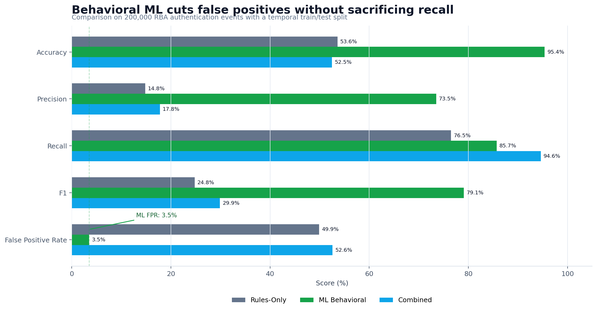
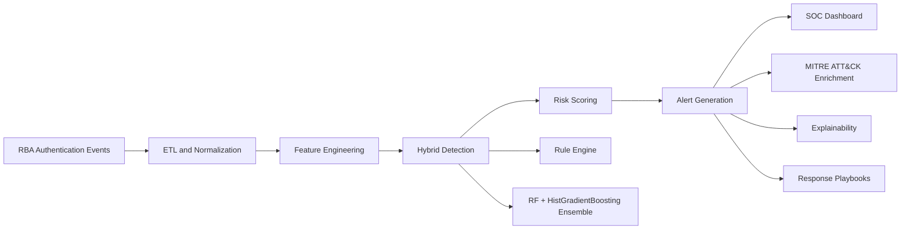
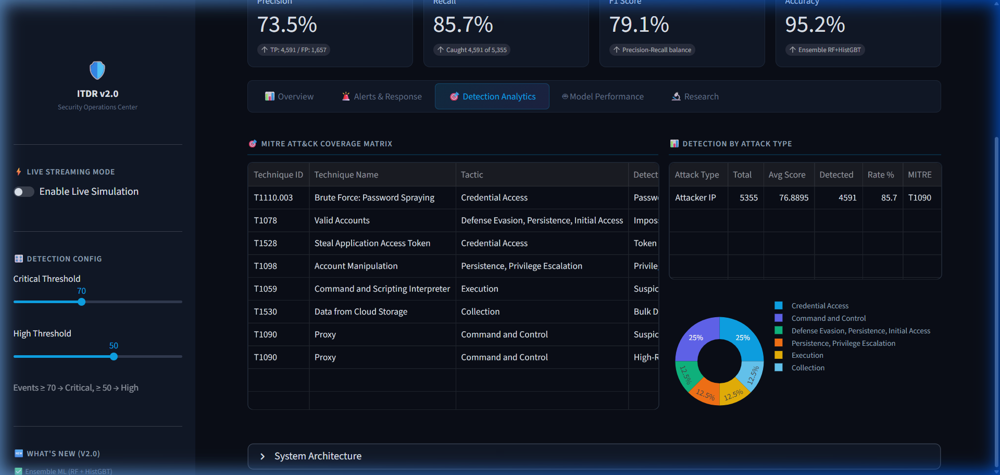
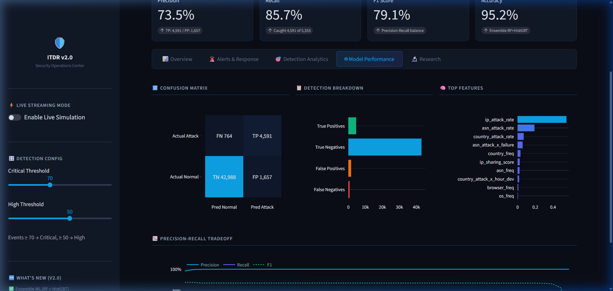

# Identity Threat Detection and Response

Behavioral ML detection engine for identity-based attacks in authentication logs.


**Live Demo:** Streamlit Cloud deployment in progress. The URL will be added here after deployment.

## Why This Exists

Identity is now one of the easiest paths into an organization. Attackers do not always need malware if they can spray passwords, reuse valid accounts, steal tokens, or abuse cloud sessions. Traditional rule-based detections catch some of this behavior, but they generate too many false positives for a SOC to trust at scale. This project builds a behavioral ML detection pipeline for authentication events, compares it against static rules, maps findings to MITRE ATT&CK, and presents the results in a Streamlit SOC dashboard with explainable alerts and response playbooks.

## Results

The strongest result from the capstone was not just higher accuracy. It was a large reduction in false positives while still catching slightly more true attacks than the rule baseline.

| Approach | Accuracy | Precision | Recall | F1 | FPR | Takeaway |
|---|---:|---:|---:|---:|---:|---|
| Rules-only baseline | 53.6% | 14.8% | 76.5% | 24.8% | 49.9% | Catches attacks, but floods analysts with false positives. |
| ML behavioral ensemble | 95.4% | 73.5% | 85.7% | 79.1% | 3.5% | Best operating point for practical SOC triage. |
| Combined rules + ML | 52.5% | 17.8% | 94.6% | 29.9% | 52.6% | Highest recall, but inherits noisy rule behavior. |



**Bottom line:** the ML ensemble reduced the false positive rate from 49.9% to 3.5%, a 14x improvement over the rules-only baseline.

## What It Does

- Detects identity threats across 200,000 authentication events from the public Risk-Based Authentication dataset.
- Compares eight deterministic detection rules against a supervised behavioral ML ensemble.
- Maps detections to MITRE ATT&CK techniques for analyst-friendly threat context.
- Generates per-alert explanations using the strongest behavioral signals behind a risk score.
- Recommends automated response playbooks such as session revocation, MFA re-challenge, IP blocking, password reset, and account quarantine.
- Provides a Streamlit SOC dashboard for alert triage, model performance, ATT&CK coverage, and research comparison.

## Architecture



Core modules:

| Area | Files |
|---|---|
| ETL and normalization | `detection/etl.py`, `import_rba_data.py` |
| Feature engineering | `detection/features.py` |
| ML training and inference | `detection/models.py`, `train_rba_model.py` |
| Rule detection | `detection/rules.py`, `detection/rules_config.yaml` |
| Evaluation | `detection/comparison_eval.py`, `docs/evaluation_metrics.json` |
| MITRE and response | `detection/mitre_mapping.py`, `detection/response.py`, `detection/alert_exporter.py` |
| Dashboard | `ui/app.py` |

## Methodology

**Dataset:** The project uses 200,000 authentication events sampled from the Login Data Set for Risk-Based Authentication. The dataset is useful for this problem because it contains real authentication behavior at scale, including user, device, browser, network, ASN, country, timestamp, and attack-label fields.

**Feature engineering:** The detector uses 27 engineered behavioral signals. Examples include login hour cyclic encoding, business-hour access, failure state, country/browser/ASN/OS frequency encoding, IP attack history, ASN and country attack history, IP sharing score, user country diversity, user typical IP count, hour deviation from user baseline, new-device detection, user failure rate, and interaction terms such as ASN risk times login failure.

**Leakage prevention:** The model uses a temporal train/test split instead of a random split. During validation, I caught a leakage risk where future entity behavior could influence training statistics. I fixed it by fitting the `FeatureExtractor` only on the training window, then applying those learned statistics to the held-out test window.

**Model choice:** The final detector is a soft-voting ensemble that combines Random Forest and Histogram Gradient Boosting. Random Forest handles mixed behavioral signals well, while Histogram Gradient Boosting gives strong tabular performance and fast training on larger datasets. A calibration split is used for precision-targeted threshold selection before final held-out evaluation.

## Screenshots

**Main dashboard**


**Alert triage with explainability and response actions**


**MITRE ATT&CK coverage and detection analytics**



**Model performance view**



**Research comparison view**


## Tech Stack

| Technology | Why it is used |
|---|---|
| Python | Main implementation language for ETL, ML, rules, testing, and dashboard glue. |
| pandas and NumPy | Authentication-event processing, feature construction, and metric analysis. |
| scikit-learn | Random Forest, Histogram Gradient Boosting, soft voting, calibration, and evaluation metrics. |
| Streamlit | Interactive SOC dashboard that recruiters and reviewers can run without a frontend build step. |
| Plotly and Matplotlib | Interactive dashboard charts and static README result visualization. |
| PyYAML | Config-driven detection rules. |
| Docker Compose | One-command local dashboard deployment. |
| pytest | Automated regression coverage for features, rules, MITRE mapping, response actions, and integration behavior. |

## How To Run

Requires Python 3.11 or newer.

```bash
git clone https://github.com/MasterSid007/Incident-Threat-Detection-and-Response.git
cd Incident-Threat-Detection-and-Response

python -m venv .venv

# Windows
.venv\Scripts\activate

# macOS/Linux
source .venv/bin/activate

pip install -r requirements.txt
streamlit run ui/app.py
```

Open `http://localhost:8501`.

The dashboard starts in demo mode from a fresh clone. The full capstone pipeline requires the RBA dataset and trained model artifacts, which are intentionally not committed because the dataset is large and externally licensed.

To reproduce the full local workflow:

```bash
# Place the RBA CSV at the repo root as rba-dataset.csv
python train_rba_model.py
streamlit run ui/app.py
```

## Docker Compose

```bash
docker compose up --build
```

The container starts the dashboard in demo mode. To run the full pipeline in Docker, mount `rba-dataset.csv` and `saved_models/` into the container after downloading and training locally.

## Testing

```bash
python -m pytest -q
python run_stress_tests.py
```

Current project validation:

- Verified in this cleanup: 24 automated tests passed.
- Capstone validation: 6 stress checks passed when the local RBA dataset and saved model artifacts are present.
- Coverage includes feature extraction, rule detection, MITRE mapping, response playbooks, explainability, comparison metrics, ETL edge cases, threshold boundaries, streaming batches, and model load/predict consistency.

## Streamlit Cloud Deployment Notes

For Streamlit Cloud, set the app entry point to:

```text
streamlit_app.py
```

`streamlit_app.py` is a small wrapper around `ui/app.py`, which keeps the real dashboard code organized while giving Streamlit Cloud the conventional root app file. The root `requirements.txt` is pinned and ready for deployment. Since the RBA dataset is too large for normal repo-based Streamlit Cloud deployment, the hosted demo should use the built-in deterministic demo mode or load a small sampled dataset from a public URL at startup. The README Live Demo link should be updated after the Streamlit Cloud app is live.

## Citations

- [Login Data Set for Risk-Based Authentication](https://www.kaggle.com/datasets/dasgroup/rba-dataset)
- [Wiefling et al., Pump Up Password Security! Evaluating and Enhancing Risk-Based Authentication on a Real-World Large-Scale Online Service](https://arxiv.org/abs/2206.15139)
- [Freeman et al., Who Are You? A Statistical Approach to Measuring User Authenticity](https://engineering.linkedin.com/data/publications/resources/2016/who-are-you--a-statistical-approach-to-reinforcing-authenticatio)
- [MITRE ATT&CK Enterprise Matrix](https://attack.mitre.org/)

## About

Built by [Siddharth Mishra](https://www.linkedin.com/in/exuberantsid/), M.S. Cybersecurity, Penn State, May 2026. More work at [sids.live](https://sids.live).

## License

MIT License. See [LICENSE](LICENSE).
