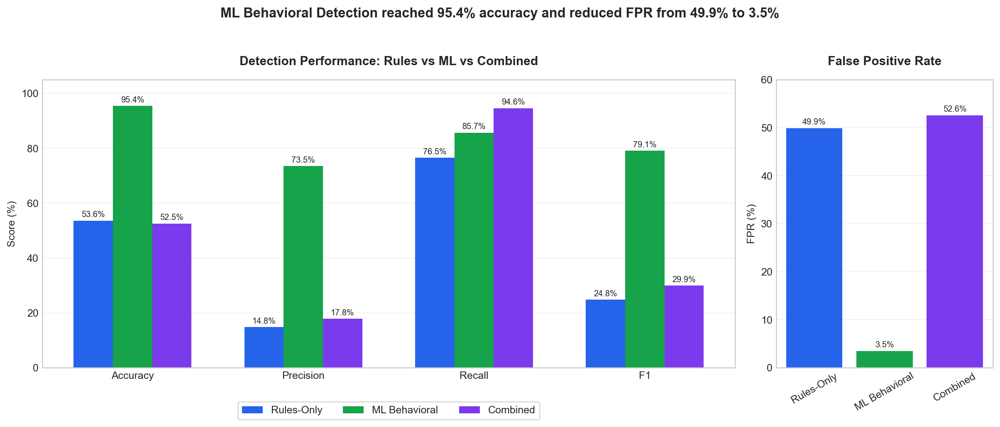
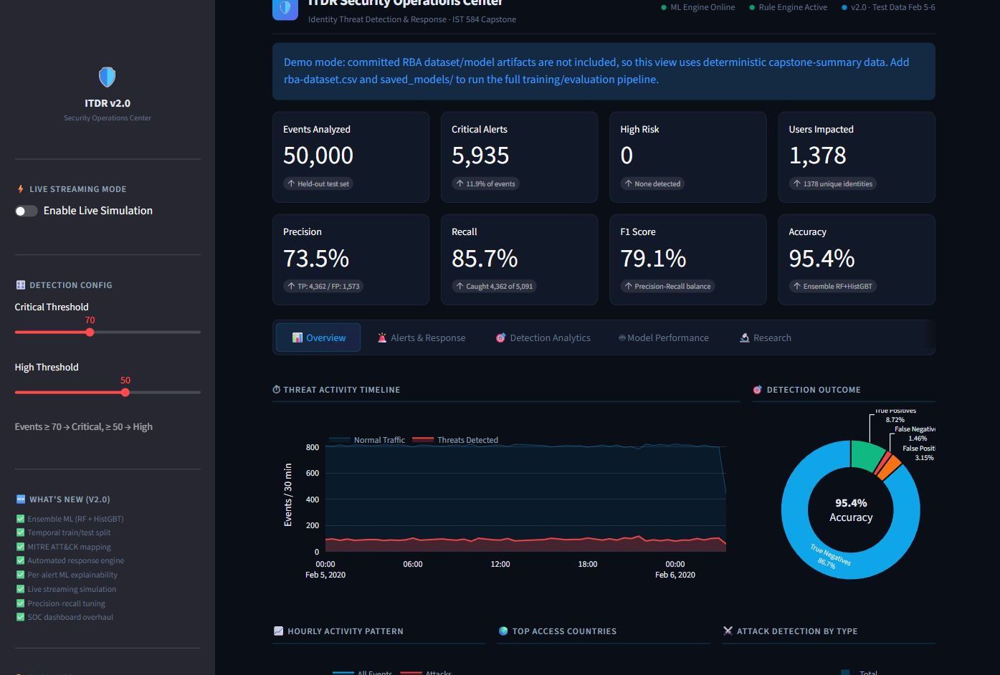
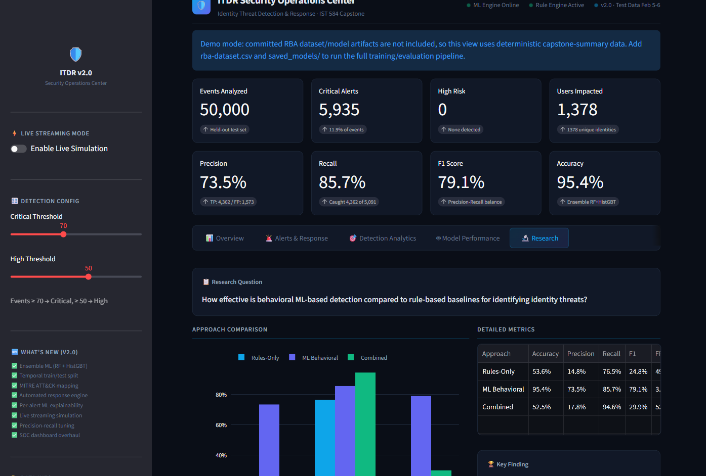
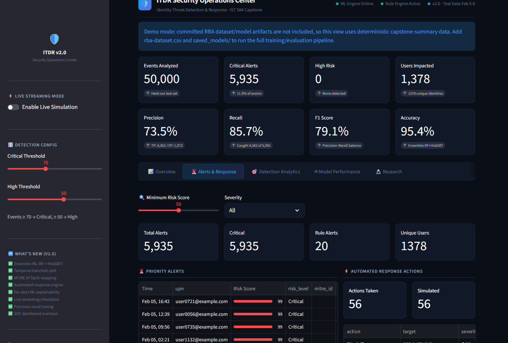

# Identity Threat Detection and Response Prototype

Behavioral identity-threat detection pipeline built for my Penn State IST 584 capstone.

**Headline result:** 95.4% accuracy and 14x false-positive-rate reduction over rule-based baselines on 200,000 real authentication events from the RBA dataset.

The system compares static identity rules against a supervised behavioral ML ensemble, maps detections to MITRE ATT&CK, and presents results in a Streamlit SOC dashboard.

## Results

| Approach | Accuracy | Precision | Recall | F1 | FPR |
|---|---:|---:|---:|---:|---:|
| Rules-only baseline | 53.6% | 14.8% | 76.5% | 24.8% | 49.9% |
| ML behavioral detection | 95.4% | 73.5% | 85.7% | 79.1% | 3.5% |
| Combined rules + ML | 52.5% | 17.8% | 94.6% | 29.9% | 52.6% |



The ML model outperformed rules-only detection by reducing false positives from 49.9% to 3.5%. The naive combined approach increased recall, but it also inherited the high false-positive rate of the rules layer, which is why the ML-only operating point is the recommended detection mode.

## Dashboard

The Streamlit dashboard works in two modes:

- **Full pipeline mode:** uses `rba-dataset.csv` and trained artifacts in `saved_models/` to run ETL, feature extraction, model inference, rule detection, MITRE enrichment, and dashboard analytics.
- **Demo mode:** if those large local artifacts are absent, the app loads deterministic capstone-summary data so reviewers can still inspect the SOC dashboard from a fresh clone.







## Methodology

- Dataset: 200,000 authentication events sampled from the Login Data Set for Risk-Based Authentication.
- Split strategy: temporal train/test split, not random split.
- Leakage fix: feature extraction statistics and attack-correlation features are fit on the training window only, then applied to the held-out test window.
- Model: soft-voting ensemble with Random Forest and HistGradientBoosting classifiers.
- Thresholding: precision-targeted threshold selection on a calibration split before final held-out evaluation.
- Features: behavioral, time, device, network, ASN, country, IP-sharing, and user-baseline signals.
- Baselines: static rules for password spraying, impossible travel, suspicious IP/ASN, token-theft indicators, and privilege-escalation patterns.

The temporal split matters because random splits can leak future entity behavior into the training set. I initially caught this issue during capstone validation and reworked the training script so the `FeatureExtractor` is fit only on pre-cutoff events.

## Architecture

```text
rba-dataset.csv
  -> detection/etl.py
  -> detection/features.py
  -> detection/models.py
  -> detection/rules.py
  -> detection/mitre_mapping.py
  -> detection/response.py
  -> ui/app.py
```

Key components:

- `train_rba_model.py` trains the leak-free temporal-split model and writes `saved_models/`.
- `detection/features.py` builds behavioral features from authentication events.
- `detection/models.py` contains the Random Forest + HistGradientBoosting ensemble.
- `detection/rules.py` implements the rules-only baseline.
- `detection/comparison_eval.py` compares Rules vs ML vs Combined detection.
- `ui/app.py` runs the Streamlit SOC dashboard.
- `tests/` covers feature extraction, rule/ML integration, MITRE mapping, response generation, and comparison metrics.

## Quick Start

Requires Python 3.11+.

```bash
git clone https://github.com/MasterSid007/Incident-Threat-Detection-and-Response.git
cd Incident-Threat-Detection-and-Response

python -m venv .venv
# Windows: .venv\Scripts\activate
# macOS/Linux: source .venv/bin/activate
pip install -r requirements.txt

streamlit run ui/app.py
```

Open `http://localhost:8501`.

Without the RBA CSV/model artifacts, the app starts in demo mode. To reproduce the full capstone run, download the RBA dataset as `rba-dataset.csv`, place it in the repo root, then run:

```bash
python train_rba_model.py
streamlit run ui/app.py
```

## Docker

```bash
docker compose up --build
```

The Docker image starts the dashboard in demo mode unless you mount `rba-dataset.csv` and `saved_models/` into the container.

## Tests

```bash
python -m pytest -q
```

Current verification: 24 tests passing locally.

## Repository Notes

The RBA dataset and trained model artifacts are intentionally not committed because the dataset is large and externally licensed. The dashboard's demo mode is included so recruiters and reviewers can still run and inspect the application immediately.

## Citations and References

- [Login Data Set for Risk-Based Authentication](https://www.kaggle.com/datasets/dasgroup/rba-dataset)
- [Wiefling et al., "Pump Up Password Security! Evaluating and Enhancing Risk-Based Authentication on a Real-World Large-Scale Online Service" (ACM TOPS 2022)](https://arxiv.org/abs/2206.15139)
- [Freeman et al., "Who Are You? A Statistical Approach to Measuring User Authenticity" (NDSS 2016)](https://engineering.linkedin.com/data/publications/resources/2016/who-are-you--a-statistical-approach-to-reinforcing-authenticatio)
- [MITRE ATT&CK Enterprise Matrix](https://attack.mitre.org/)

## License

MIT License. See [LICENSE](LICENSE).
